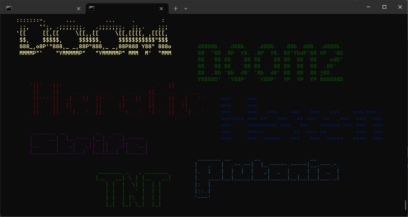

# Choco

## Simple frontend for Chocolate Doom on Raspberry Pi

Runs on the console/terminal:



### Quick start

Install chocolate-doom:

```console
sudo apt-get install chocolate-doom
```

Download WAD files (see below).

Clone and build this repo:

```console
git clone https://github.com/DeShrike/choco.git
cd choco
make
```

Copy choco, choco.ini and play to the folder that has your WAD files (for example /home/pi/wad).

```console
cp choco /home/pi/wad
cp choco.ini /home/pi/wad
cp play /home/pi/wad
```

### WAD files

chocolate-doom uses these WAD files:

- doom.wad
- doom2.wad
- heretic.wad
- hexen.wad
- STRIFE1.WAD
- VOICES.WAD
- plutonia.wad
- tnt.wad

You can download these from various places.

You can disable certain games in choco.ini if you don't have the WAD file for it.

### Start the frontend

```console
cd /home/pi/wad
./play
```

